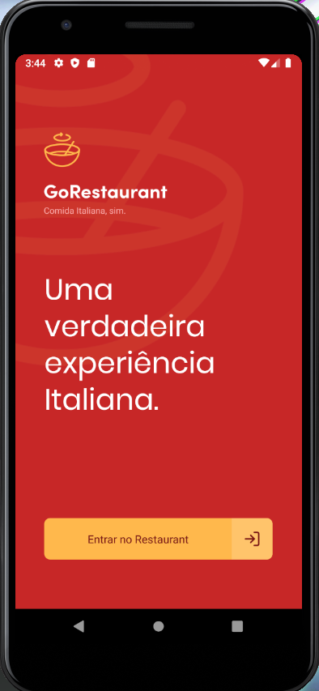
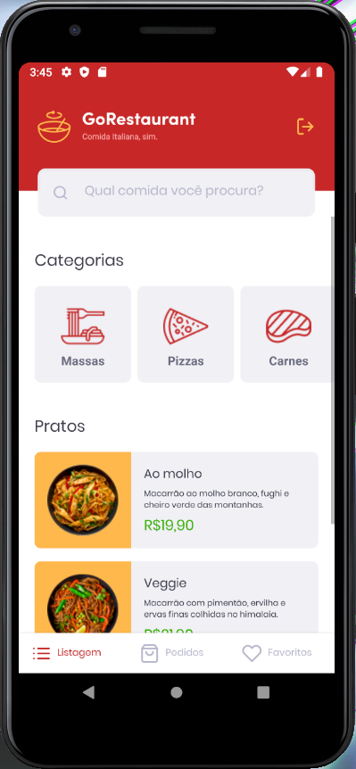
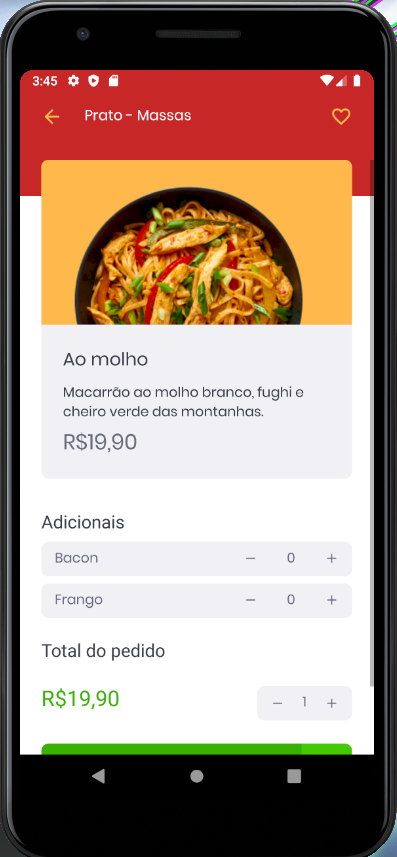
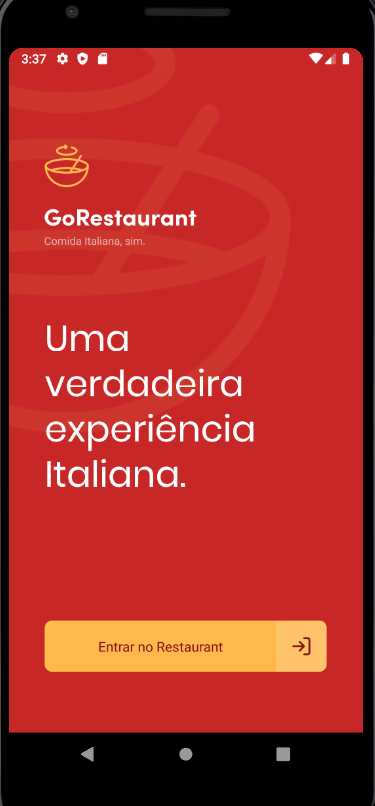

# 🍕 GoRestaurant Web

## 🔖 Sobre

  A aplicação consiste em exibir pratos da api, podendo pesquisar pratos e filtrá-los por categoria.
  Além disso, é possível criar pedidos e adicionar pratos aos favoritos

## 📷 Screenshot:

  
  
    
  

## 👷 Instalação:

<strong>
  Necessário instalar <a href="https://yarnpkg.com/">Yarn</a>.
  Para clonar o projeto usando HTTPS, use este comando:
</strong>

<pre>
    git clone https://github.com/pdrolucasz/GoRestaurant-Mobile.git
</pre>

<strong>Navegue até a pasta do projeto e instale as dependências usando esse comando: </strong>

<pre>
    yarn
</pre>

### 📎 Utilizando uma fake API

<strong>Esse projeto usa os dados de um arquivo como fake API.</strong>

<strong>Para executar esse servidor você pode executar o seguinte comando:</strong>

<pre>
    yarn json-server server.json -p 3333
</pre>

### 🏃 Finalizando

<strong>Para iniciar a aplicação em ambiente de desenvolvimento, utilize esse comando:</strong>

<pre>
    yarn start
</pre>

<strong>Para iniciar o emulador, utilize um desses comandos:</strong>

<pre>
    yarn android ou yarn ios
</pre>

<strong>Caso esteja usando um emulador/sistema android, utilize esse comando:</strong>

<pre>
    adb reverse tcp:3333 tcp:3333
</pre>

#

<h3 align="center"> Made with 💜 by <a href="https://www.linkedin.com/in/pedro-lucas-4b2941199/">Pedro Lucas</a></h3>
